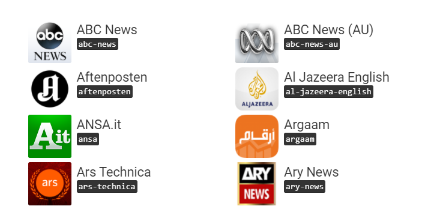

# End-to-end tutorial to tackle topic mining and interactive visualizations in python

In this tutorial we'll dive in topic mining. We'll analyze a dataset of newsfeeds extracted from more than 60 sources thanks to a web service called <a href="https://newsapi.org"> newsapi.org </a>.

<p align="center">
  
</p>

We'll show how to process this text data, analyze it and extract visual clusters of topics from it. 

We'll show how to put in practice great python tools for interactive visualization, topic mining and text analytics: **scikit-learn**, **gensim** for the modeling, **Bokeh** and **PyLDAvis** the plots.

All the code is available to you to run and test.

You can either visualize the notebook on <a href="https://github.com/ahmedbesbes/How-to-mine-newsfeed-data-and-extract-interactive-insights-in-Python/blob/master/article_2.ipynb"> github </a> or on <a href="https://ahmedbesbes.com/how-to-mine-newsfeed-data-and-extract-interactive-insights-in-python.html"> my website </a>.


### Environment setup

In this tutorial, I'll be using python 2.7

One thing I recommend is downloading the Anaconda distribution for python 2.7 from this link. This distribution wraps python with the necessary packages used in data science like Numpy, Pandas, Scipy or Scikit-learn.

```shell
pip install tqdm
conda install -c anaconda nltk=3.2.2
conda install bokeh
pip install --upgrade gensim
pip install pyldavis
pip install wordcloud

```

<blockquote class="twitter-tweet" data-lang="fr"><p lang="en" dir="ltr">How to mine newsfeed data and extract interactive insights in <a href="https://twitter.com/hashtag/Python?src=hash&amp;ref_src=twsrc%5Etfw">#Python</a> <a href="https://twitter.com/hashtag/DataScience?src=hash&amp;ref_src=twsrc%5Etfw">#DataScience</a> <a href="https://twitter.com/hashtag/NLP?src=hash&amp;ref_src=twsrc%5Etfw">#NLP</a> <a href="https://t.co/KLNI4CVvfi">https://t.co/KLNI4CVvfi</a> <a href="https://t.co/pd5XiC7N0o">pic.twitter.com/pd5XiC7N0o</a></p>&mdash; KDnuggets (@kdnuggets) <a href="https://twitter.com/kdnuggets/status/989191823523504128?ref_src=twsrc%5Etfw">25 avril 2018</a></blockquote>

